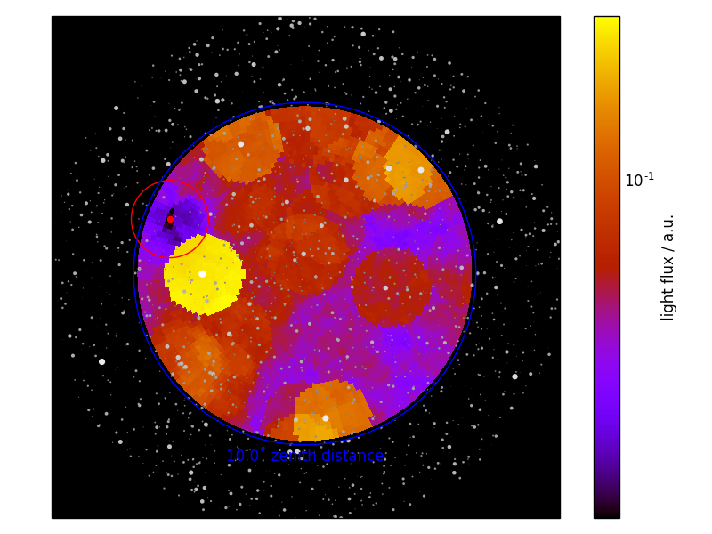

# darkspot

This module provides the script `find_darkspot`,
which gives you the darkest spot in the sky close
to zenith for a given date and time.

Darkest spot means area with the size of the FACT FoV
(4.5 degrees) that has the lowest light flux.

## installation:

```
pip install git+https://github.com/fact-project/darkspot 
```

Optionally, for plotting support, also install `cartopy`:
```
conda install geos proj4
pip install cartopy
```

## Usage:

Just start the script
```
find_darkspot
```
and you will be prompted for date and time.
Result:
```
Please enter date and time for the ratescan
This is the real date, be aware for times after 0:00
Date (YYYY-MM-DD): 2016-02-02
Time UTC: (hh:mm): 22:15 
best ratescan position:                                                        
RA: 5.30 h
DEC: 25.28°
Az: 248.0°
Alt: 81.5°
Brightest star in FOV: 6.78 mag

Output for FACT schedule:
"ra":5.295, "dec": 25.284
```

```
find_darkspot --plot
```
will display the sky with the FoV of FACT at the selected darkspot


```
find_darkspot --plot --show-flux
```
will add the light flux as color:



## Background:

This module uses the Hipparcos Star catalogue and
takes all stars into account that are brighter than 
10 mag.

Planets are added using the `ephem` library.
